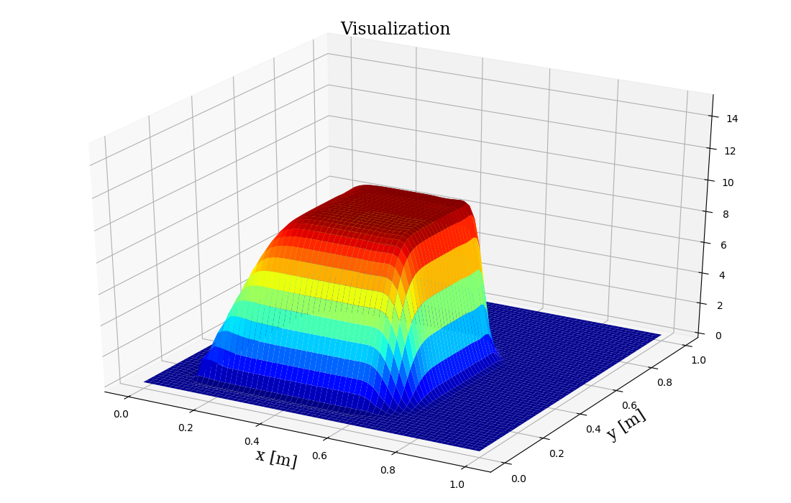
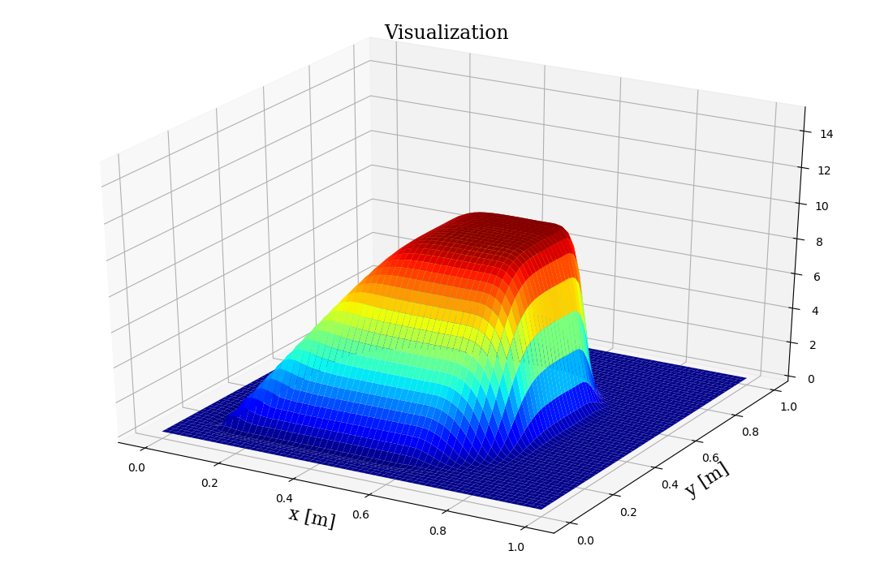
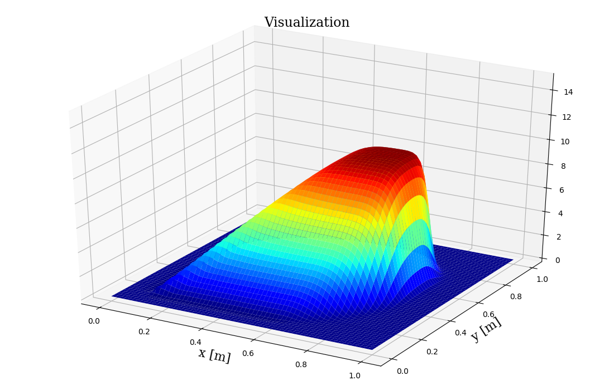
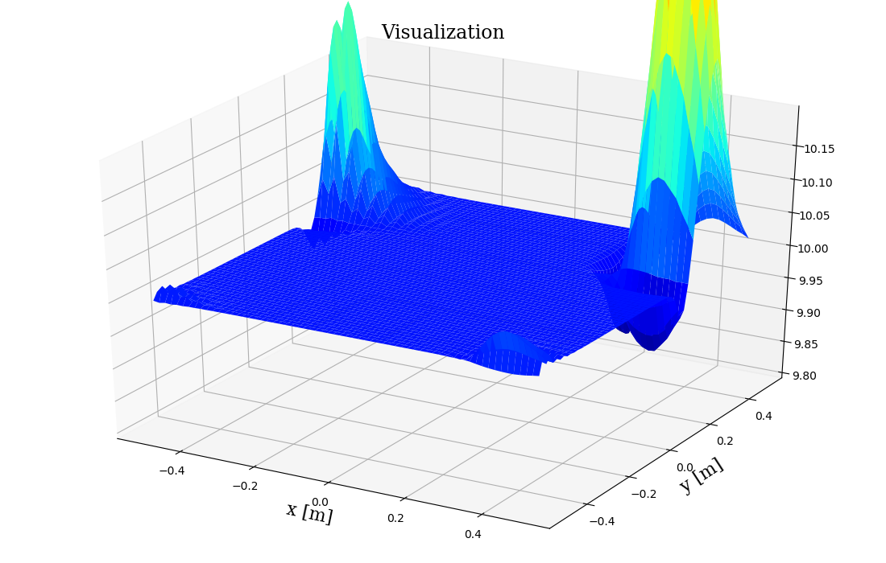
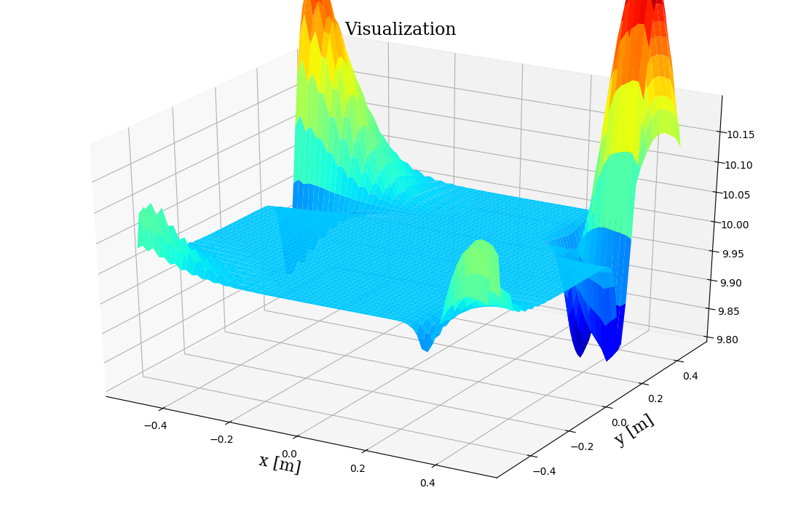
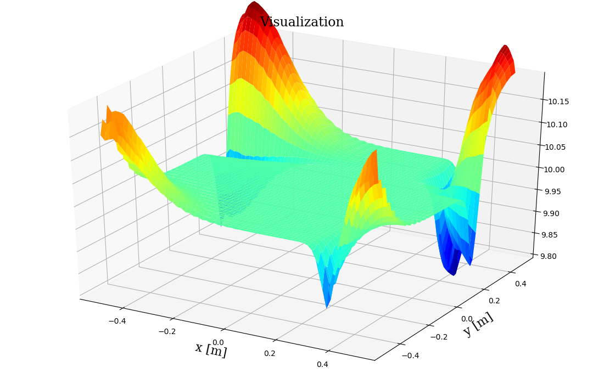

# 2D Numerical PDES on a square mesh
Information:
Uses the TVDRK3 time integrator with a 5th order WENO state reconstruction.
Riemann solve performed by a Rusanov flux calculation.
Problems solved here: 2D Burgers equation (1 dependent variable), 2D Shallow water equations (3 conserved variables)

## Dependencies:
1. python 3.6.8 gcc 7.3.0
3. numpy 1.19.1
3. matplotlib 3.1.0

## What you should see

### Field evolution for Burgers

### Field evolution for shallow water equations

