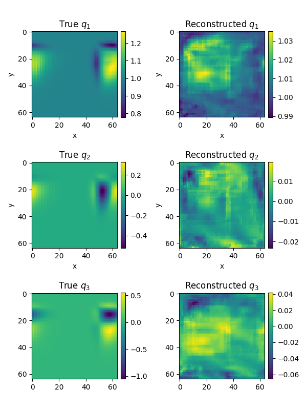
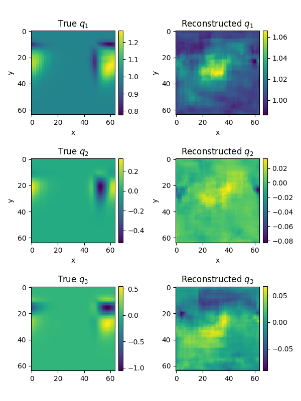
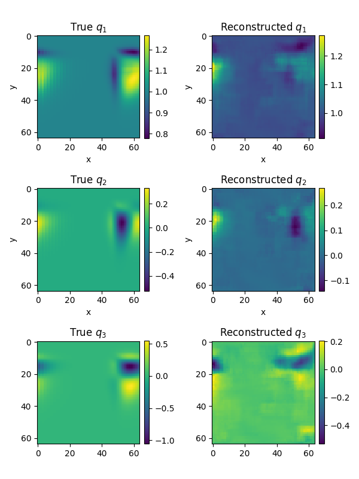
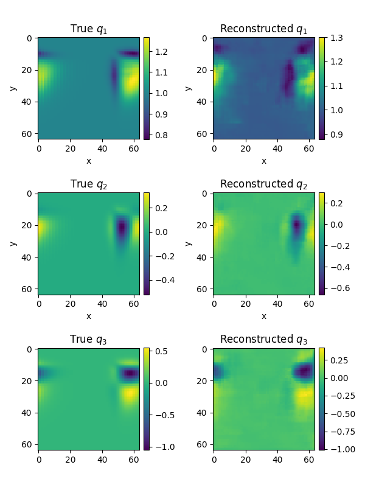

# Hierarchical nonlinear PCA using convolutional autoencoders

Implement a standard convolutional autoencoder and a hierarchical nonlinear PCA using the same convolutional autoencoder. We use the approach of Scholz and Vigario (see PDF in the folder) for the latter. 

Note: Work in progress but the right type of results are starting to show up already

## To run
Set `npca` to `False` for regular autoencoder or `True` for h-NPCA and use `python main.py`. This code is tested using numpy 1.19, tensorflow 2.3 and matplotlib 3.1.1.

## Sample visualizations showing hierarchical reconstruction improvement by "activating" latent space variables in CAE with NPCA.

You can find a gradual improvement in the quality of the reconstruction as we "activate" more variables (from the same trained model). This embeds some hierarchy in the latent space behavior.

### Using 1 active latent space variable

### Using 2 active latent space variables

### Using 3 active latent space variables

### Using 4 active latent space variables

### Using 5 active latent space variables

### Using 6 active latent space variables

### Using 7 active latent space variables

### Using 8 active latent space variables
