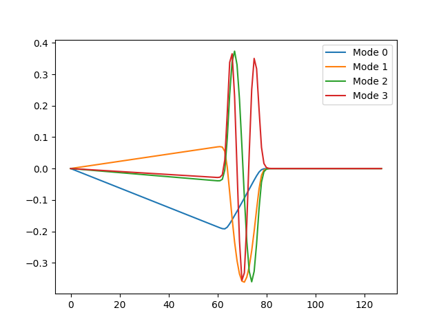
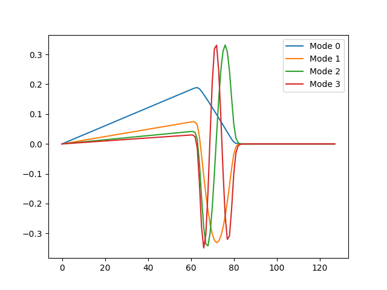

# Online SVD
Deploys algorithm specified in:

"Sequential Karhunen–Loeve Basis Extraction and its Application to Images" by Avraham Levy and Michael Lindenbaum. IEEE TRANSACTIONS ON IMAGE PROCESSING, VOL. 9, NO. 8, AUGUST 2000.

## What you should see:

After using 100 snapshots initially:

After using 20 new snapshots:

After using 50 newer snapshots:

