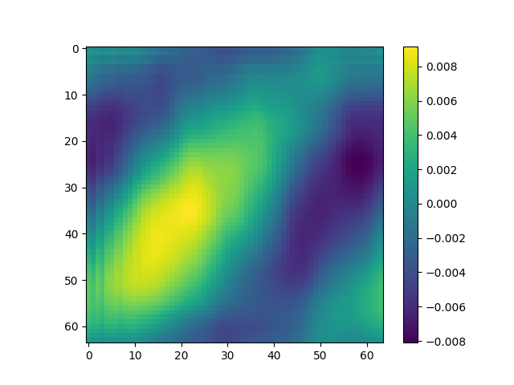
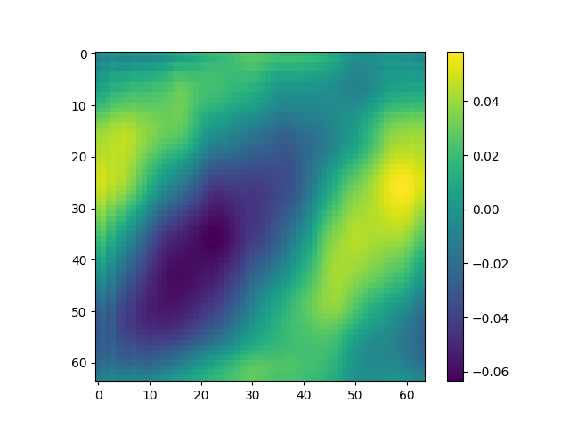
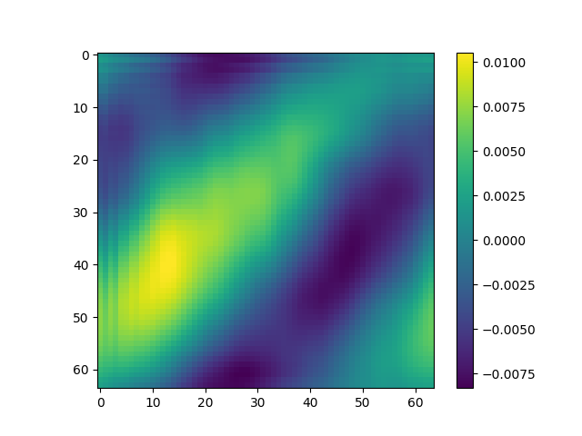

# Parallelized proper orthogonal decomposition

This repository contains two parallel algorithms for accelerating POD basis construction from snapshot data
1. `APMOS.py` uses Algorithm 3 of "Approximate partitioned method of snapshots for POD" by Wang, McBee, Iliescu. Parallel in the DOFs.
2. `Dual_POD.py` uses the `DualPOD` function of Algorithm 1 in Jacquier et al., ArXiv:2005.13596v4. Parallel in Snapshots.

Both PDFs are attached in this repo.

Run script by using `mpirun -np 6 python APMOS.py` or `mpirun -np 6 python Dual_POD.py` after making sure BLAS does not use all threads (if you're on one node only) `export OPENBLAS_NUM_THREADS=1`.

Data is not on this repository (too large) but in principle you can easily interface your own data matrix with these scripts. If you still want the data, contact me personally.

## Example POD mode extraction

### Serial method of snapshots

### APMOS

### Dual POD
