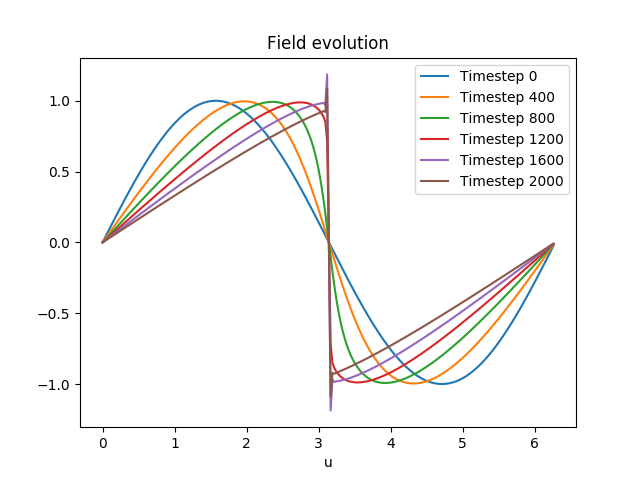
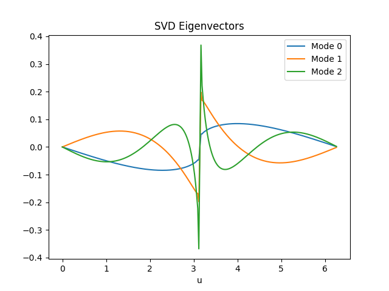
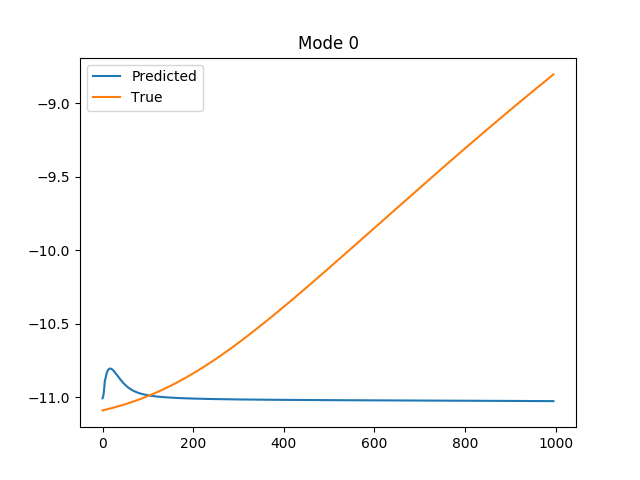
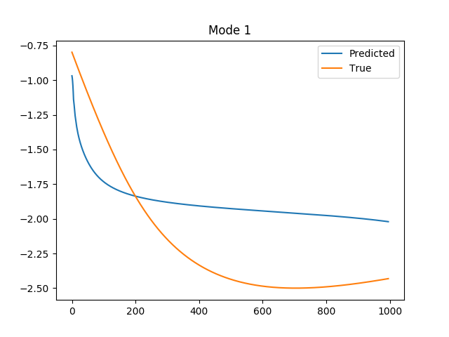
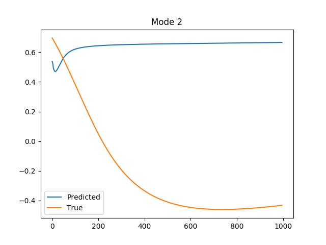

# Steps to reproduce
1. Run `cmake ..`  from within `build/` directory.
2. Run `make` from within `build/` directory.
3. `export PATH=/home/rmlans/anaconda3/envs/tf2_env/bin:$PATH`. Point to your specific python executable.
4. `export LD_LIBRARY_PATH=/home/rmlans/anaconda3/envs/tf2_env/lib:$LD_LIBRARY_PATH`. Add the python so file to the library path. This python should have numpy, tensorflow and matplotlib installed.

# Versions:
1. cmake 3.10.2
2. python 3.6.8 gcc 7.3.0
3. numpy 1.18.1
4. tensorflow 2.2.0
5. matplotlib 3.1.0

# What you should see

## Field evolution

## Modal decomposition

## Forecasting the modal evolution in time (still rather poor but you get the idea)

