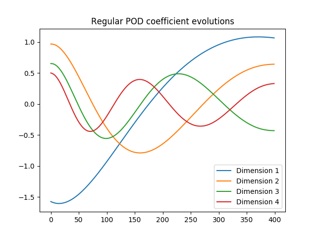
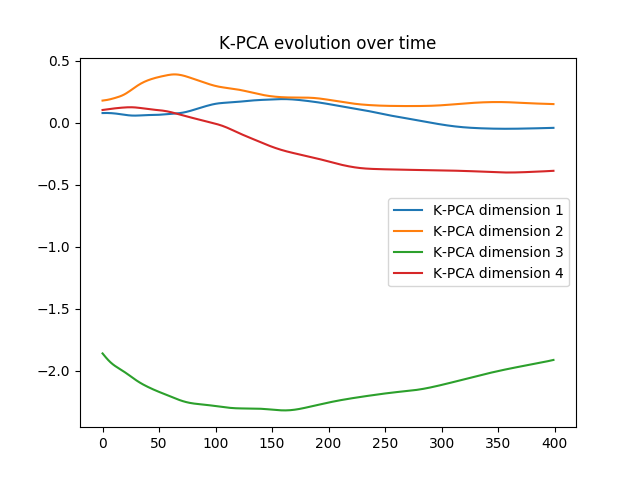

# Kernel-POD

An implementation of Kernel POD for the viscous Burgers equations. 

### Regular POD coefficient evolution over time

### RBF Kernel POD coefficient evolution over time

Note that a nonlinear function approximation must be performed for recovering physical space data from the K-POD space representation (not implemented here)